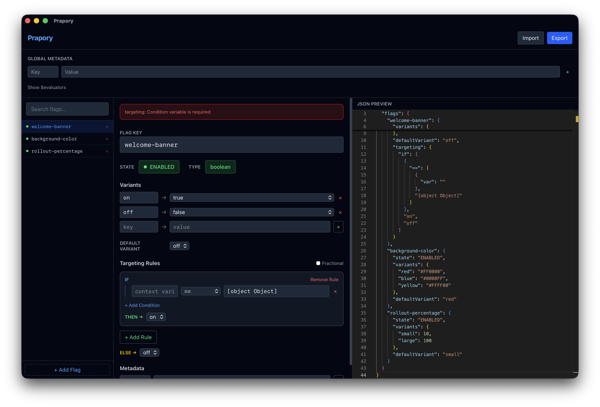

# Prapory

> Візуальний редактор конфігурацій [flagd](https://flagd.dev/) feature flags — десктоп-застосунок і веб.
>
> *"Prapory" (Прапори) means "flags" in Ukrainian.*



[](https://stand-with-ukraine.pp.ua)
[](../../actions/workflows/build.yml)
[](../../releases)
[](LICENSE)

This project is made in Ukraine. We stand for freedom and democracy.

---

## Українською

Візуальний редактор для конфігурацій [flagd](https://flagd.dev/) — open-source демона feature flags з проєкту [OpenFeature](https://openfeature.dev/). Дозволяє створювати, редагувати та керувати feature flags через зручний інтерфейс замість ручного редагування JSON.

### Можливості

- **Список прапорців** — бокова панель з пошуком, додаванням та видаленням
- **Редактор прапорця** — форма для редагування ключа, стану, типу, варіантів, правил таргетингу та метаданих
- **JSON панель** — Monaco Editor з двосторонньою синхронізацією (зміни у формі оновлюють JSON і навпаки)
- **Імпорт/Експорт** — завантаження та вивантаження flagd JSON файлів
- **Валідація** — перевірка конфігурації в реальному часі
- **Таргетинг** — візуальний конструктор правил if/then/else з операторами (`==`, `!=`, `in`, `ends_with`, `starts_with`, `sem_ver`)
- **Fractional rollout** — розподіл трафіку між варіантами за вагою
- **$evaluators** — глобальні фрагменти правил таргетингу

### Завантаження

Готові інсталятори для macOS (ARM / Intel), Windows та Linux доступні на сторінці [Releases](../../releases).

#### Примітка для macOS

Застосунок не підписаний сертифікатом Apple Developer. macOS Gatekeeper може заблокувати його при першому запуску. Щоб відкрити:

- **Варіант А**: Правий клік на застосунок > **Відкрити** > **Відкрити** у діалозі
- **Варіант Б**: Виконати в терміналі:
  ```bash
  xattr -cr /Applications/Prapory.app
  ```

### Технології

React 18, TypeScript, Vite, Tailwind CSS v4, Zustand, Monaco Editor, Tauri v2.

### Запуск локально

Вимоги: [Bun](https://bun.sh/) >= 1.0, [Rust](https://rustup.rs/) stable (для десктоп-збірки).

```bash
bun install          # встановити залежності
bun run dev          # веб dev-сервер на http://localhost:1420
bun run tauri:dev    # десктоп-застосунок з hot-reload
bun run tauri:build  # зібрати десктоп-інсталятор
bun run build        # зібрати веб-версію в dist/
```

### Використання

1. Натисніть **+ Add Flag** щоб створити новий прапорець
2. Редагуйте ключ, стан, тип та варіанти у формі
3. Додайте правила таргетингу через конструктор або ввімкніть fractional rollout
4. JSON оновлюється автоматично у правій панелі — можна також редагувати JSON напряму
5. **Import** — завантажте існуючий flagd JSON файл
6. **Export** — скачайте конфігурацію як `flagd.json`

---

## English

A visual GUI editor for [flagd](https://flagd.dev/) — an open-source feature flag daemon from the [OpenFeature](https://openfeature.dev/) project. Create, edit and manage feature flags through a convenient interface instead of hand-editing JSON.

### Features

- **Flag list** — sidebar with search, add and delete
- **Flag editor** — form for key, state, type, variants, targeting rules and metadata
- **JSON panel** — Monaco Editor with two-way sync (form changes update JSON and vice versa)
- **Import / Export** — load and save flagd JSON files
- **Validation** — real-time configuration checks
- **Targeting** — visual rule builder with if/then/else and operators (`==`, `!=`, `in`, `ends_with`, `starts_with`, `sem_ver`)
- **Fractional rollout** — split traffic between variants by weight
- **$evaluators** — global reusable targeting rule fragments

### Download

Ready-made installers for **macOS** (ARM / Intel), **Windows** and **Linux** are available on the [Releases](../../releases) page.

#### macOS note

The app is not code-signed with an Apple Developer certificate. macOS Gatekeeper may block it on first launch. To open:

- **Option A**: Right-click the app > **Open** > **Open** in the dialog
- **Option B**: Run in terminal:
  ```bash
  xattr -cr /Applications/Prapory.app
  ```

### Tech stack

React 18, TypeScript, Vite, Tailwind CSS v4, Zustand, Monaco Editor, Tauri v2.

### Getting started

Prerequisites: [Bun](https://bun.sh/) >= 1.0, [Rust](https://rustup.rs/) stable (for desktop builds).

```bash
bun install          # install dependencies
bun run dev          # web dev server at http://localhost:1420
bun run tauri:dev    # desktop app with hot-reload
bun run tauri:build  # build desktop installer
bun run build        # build web version to dist/
```

### Usage

1. Click **+ Add Flag** to create a new flag
2. Edit key, state, type and variants in the form
3. Add targeting rules or enable fractional rollout
4. JSON updates automatically in the right panel — you can also edit JSON directly
5. **Import** — load an existing flagd JSON file
6. **Export** — download configuration as `flagd.json`

---

## License

[MIT](LICENSE)
